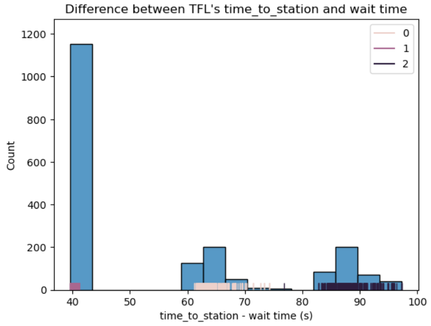

# Commute Status

## Overview

A dashboard showing useful information for my commute to campus. 

The TfL app only shows confirmed delays and disruption, which can sometimes be late or vague. By using TfL's API as a source of train data, potential delays can be identified before official confirmation, as well as being able to check when the next train is.

Powered by TfL Open Data.

---

## Instructions

1. Clone this repository and install dependencies.
```bash
git clone https://github.com/lewistang-uk/commute-status.git
pip install -r requirements.txt
```

2. An API key should be saved into a .env file, with the format API_KEY = key. A key can be obtained here: https://api-portal.tfl.gov.uk/

3. Run the app from the project root.
```bash
streamlit run streamlit/app.py
```

Alternatively, follow this link: https://twwlkzgnhepagkezvnhshj.streamlit.app/

---

## Data Source

TfL's API was used to get live train data and to create a dataset for analysis. Roughly one hour of train arrival information at stations on the Wimbledon branch of the District Line was collected (API request every 20-30 seconds).

The API can return data older than the data from the previous request. For train arrival information, this can be detected by calculating the difference between implied time to station (Arrival Time - Query Time) and TfL's time to station. Cluster analysis confirmed this distribution (K-Means, silhouette score 0.934).



---

## Limitations

The data collected only spans an hour during a weekday afternoon, so longer-term averages and trends cannot be reliably identified. Care must be taken when making assumptions involving other time periods (eg. early-morning, late-night, weekends).

In addition, having no eastbound train departure information from Southfields was possible, due to the train origin (Wimbledon) only being a few minutes away. Headway estimates had to be calculated using information from stations down the line (East Putney, Putney Bridge, Fulham Broadway) and assumed to be a good estimate of the headway at Southfields.

The dashboard is designed to be run with no historical data, since constant data collection is impractical at this stage of development.

---

## Findings

- A large majority of eastbound trains have destination Edgware Road, which requires a change at Earl's Court to get to campus. This leads to a useful feature: if a train is direct to South Kensington (destination Upminster, Tower Hill, Barking etc.), the dashboard indicates that the next train is direct.

- TfL's time to station is always positive, but the effects of the API described above make this unreliable for waiting time. Instead, implied time to station should be used for a next train indicator, with negative values indicating that the train is already at the platform.

- The halved headway of trains along the line (135.1 seconds) gave a satisfactory estimate of average wait times at Southfields when compared to the collected data through a Monte Carlo simulation (131.1 seconds, 50k iterations). 

- Delays can be detected if the train is held at the platform for longer than scheduled (normally 20-30 seconds), or if the time between trains is longer than expected (327 seconds by Tukey's Outlier Criterion).

---

## Future Improvements

- Westbound train data could be analysed and implemented in the dashboard.
- Further contextual information could be gathered to provide more informative delay reasons (eg. weather, sporting fixtures at Wimbledon/Craven Cottage/Stamford Bridge).
- Data could be gathered over a longer period of time and analysed to verify that findings hold over different periods of time.
