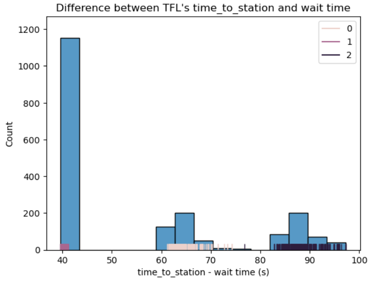
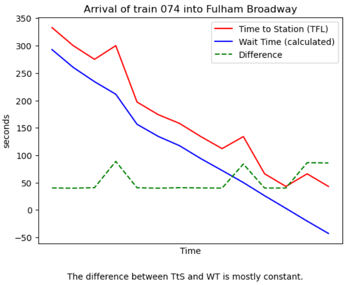
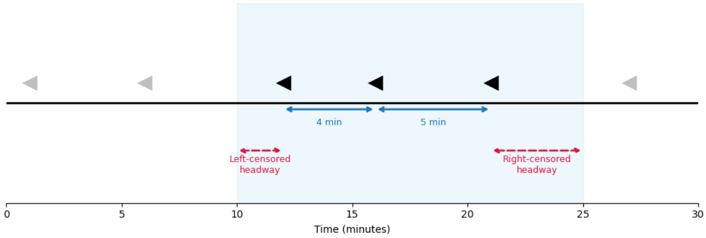
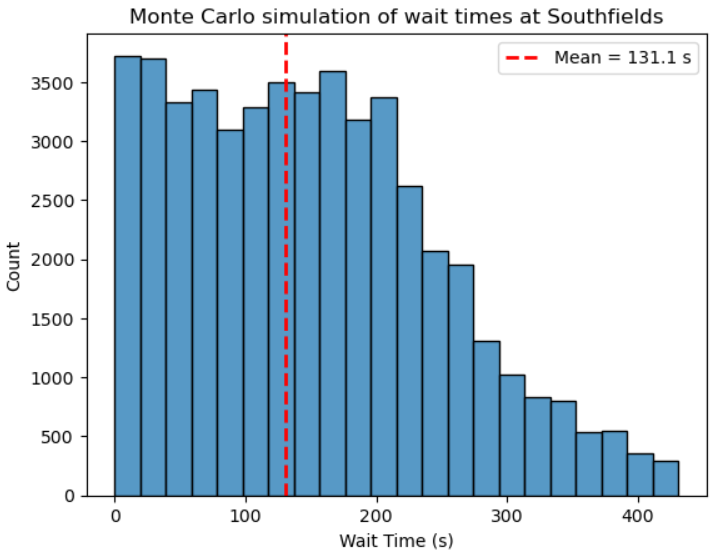

# Commute Status

## Overview

A dashboard showing useful information for my commute to campus. 

The TfL app only shows confirmed delays and disruption, which can sometimes be late. By using TfL's API as a source of train data, potential delays can be identified before official confirmation, as well as being able to check when the next train is.

KPIs (headways, wait times and excess wait times) can also be tracked over time to identify trends in service patterns.

Powered by TfL Open Data.

---

## Instructions

1. Clone this repository and install dependencies.
```bash
git clone https://github.com/lewistang-uk/commute-status.git
cd commute-status
pip install -r requirements.txt
```

2. An API key should be saved into a .env file, with the format API_KEY = key. A key can be obtained here: https://api-portal.tfl.gov.uk/

3. Run the app from the project root.
```bash
streamlit run streamlit/app.py
```

Alternatively, follow this link: https://twwlkzgnhepagkezvnhshj.streamlit.app/

---

## Data Source

TfL's API was used to get live train data and to create a dataset for analysis. 

Initially, roughly one hour of train arrival information at selected stations on the Wimbledon branch of the District Line was collected (API request every 20-30 seconds). No data was available for Wimbledon or West Brompton due to being National Rail stations.

This was later expanded into an SQLite database (data/tfl_train_data.db) by regularly polling data from the API during the morning peak. A variety of arrival information was collected, but only eastbound departures from Fulham Broadway are being regularly polled. Google Cloud Scheduler and GitHub Actions are being used to control the frequency of polling.

The API returns the destination Edgware Road for all eastbound trains from Southfields, even though some trains have alternative destinations. We cannot determine if a train is direct or not based on a query at Southfields.

Also, the API can return data older than the data from the previous request. For train arrival information, this can be detected by calculating the difference between the calculated time to station (Arrival Time - Query Time) and TfL's time to station. Cluster analysis confirmed this signal (K-Means, silhouette score 0.934).

| TfL - Calculated Time To Station | Example from the Data |
|----------------------------------|----------------------------------|
|  |  |

---

## Average Headway and Wait Time Estimates 

In the majority of observations, the number of eastbound trains showing from Southfields is less than two, so headways could not be reliably calculated. Headway estimates were calculated using information from Fulham Broadway (tripling the window for arrival information) and assumed to be a good estimate of the headway at Southfields.

| Censoring in Headway Calculation |
|------------------------|
|  |

Extending the window for information reduced the effect of right censoring since the last headway can be ignored while having adequate data. However, left censoring was still a problem, since previous trains do not show on the departure board. 

### Solutions to Left Censoring
| Description | Benefits | Drawbacks |
|-------------|----------|-----------|
| Drop the first headway (chosen)| Simple to query | Reduces number of headway observations with an already low sample size |
| Find the first headway | More data could improve accuracy | Subject to the inspection paradox - a longer headway is more likely to be sampled |

The expected wait time can be calculated from the headways, proportional to the sum of squared headways divided by the sum of headways. These KPIs can be tracked over time, using the arrivals database for historic headway data. A current view (compares current KPIs to the last four polls) and a 1-day view (compares the current day's KPIs to the last four days) have been implemented in the dashboard.

---

## KPIs

| KPI | Description |
|-----|-------------|
| Average Headway | Average gap between consecutive trains |
| Average Wait Time | The expected wait for a passenger, assuming uniform and independent distribution of passenger arrivals |
| Excess Wait Time | The extra time the average passenger spends waiting for a train compared to regular operations |

Example query to find the last five headways and wait times: 
```sql
WITH fby AS (
    SELECT 
        device_query_time,
        time_to_station,
        LAG(time_to_station) OVER (PARTITION BY device_query_time ORDER BY time_to_station) AS prev_tts
    FROM arrivals
    WHERE station = "FBY"
    AND NOT COALESCE(direction, "N/A") = "inbound"
)
SELECT
    CASE 
        WHEN COUNT(*) = 1 THEN NULL 
        ELSE ROUND(SUM(COALESCE(time_to_station-prev_tts, 0)) / (COUNT(*)-1), 1) 
    END AS avg_headway,
    CASE 
        WHEN COUNT(*) = 1 THEN "N/A" 
        ELSE ROUND(SUM(COALESCE((time_to_station-prev_tts) * (time_to_station-prev_tts), 0)) / (2*(SUM(COALESCE(time_to_station-prev_tts, 0)))), 1)
    END AS avg_wait_time
FROM fby
GROUP BY device_query_time
ORDER BY device_query_time DESC
LIMIT 5
;
```

All queries used to find KPIs can be found in the scripts folder (queries.sql).

---

## Findings

- TfL's time to station is always positive, but the effects of the API described above make this unreliable for waiting time. Instead, implied time to station should be used for a next train indicator, with negative values indicating that the train is already at the platform.

- The halved headway of trains along the line (135.1 seconds) gave a satisfactory estimate of average wait times at Southfields when compared to the collected data through a Monte Carlo simulation (131.1 seconds, 50k iterations). Analysis through probability theory gave a different result for the average wait time at Southfields (101.9 seconds) due to delays, showing that the halved headway is only accurate assuming a constant headway.

| Monte Carlo Simulation |
|------------------------|
|  |

---

## Future Improvements

- Westbound train data could be analysed and implemented in the dashboard, improving delay detection.
- Further contextual information could be gathered to provide more informative delay reasons (eg. weather, sporting fixtures at Wimbledon/Craven Cottage/Stamford Bridge).
- Analyse the proportion of direct trains.
